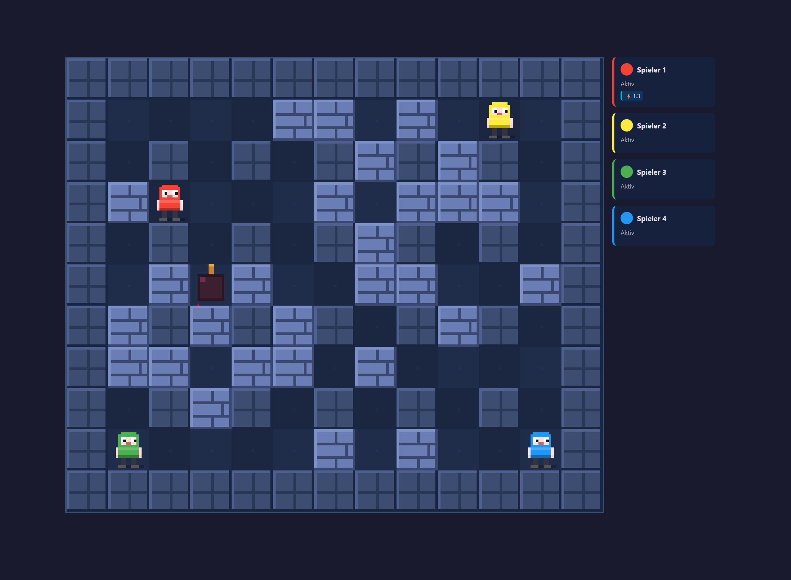

<h1 align="center">💣Boomerboy</h1>

<p align="center">
  <strong>Retro Pixel Multiplayer Arena</strong><br>
  A local multiplayer game for 2–4 players on a shared keyboard. Pure HTML5 Canvas — one file, zero dependencies.<br>
  <sub>Built with <a href="https://kiro.dev">Kiro</a></sub>
</p>

---

## Table of Contents

- [Features](#features)
- [Screenshot](#screenshot)
- [Quick Start](#quick-start)
- [Controls](#controls)
- [How to Play](#how-to-play)
- [Architecture](#architecture)
- [Development](#development)
- [Tests](#tests)
- [Built with Kiro](#built-with-kiro)
- [License](#license)

## Features

- 🎮 **2–4 players** on a single keyboard (local multiplayer)
- 💣 **Bombs, chain explosions** and destructible walls
- ⚡ **Power-ups** (extra bombs, bigger range, speed boost)
- 🎨 **Pixel-art retro graphics** with HTML5 Canvas
- 📦 **Zero dependencies** — a single HTML file
- 🔄 **Randomly generated maps** for every round
- 🌐 **Bilingual** — German and English UI (auto-detected, switchable)

> **Note:** The game auto-detects browser language (DE/EN). A toggle button is available on the start screen.

## Screenshot

<p align="center">
  
</p>

## Quick Start

```bash
# Option 1: Just open the file
open index.html

# Option 2: Clone and open
git clone https://github.com/achimbarczok/boomerboy.git
cd boomerboy
open index.html
```

No server, no build, no installation. Works in any modern browser.

## Controls

| Player | Move | Bomb |
|--------|------|------|
| 🔴 Player 1 | `W` `A` `S` `D` | `Space` |
| 🟡 Player 2 | `↑` `←` `↓` `→` | `Enter` |
| 🟢 Player 3 | `I` `J` `K` `L` | `U` |
| 🔵 Player 4 | `Num8` `Num4` `Num5` `Num6` | `Num0` |

> **Note:** Player 4 requires NumLock to be enabled.

## How to Play

1. Select player count on the start screen (2, 3, or 4)
2. Place bombs to destroy walls and eliminate opponents
3. Collect power-ups hidden under destructible walls:

| Power-Up | Symbol | Effect |
|----------|--------|--------|
| Extra Bomb | **B** (purple) | +1 bomb capacity |
| Bigger Explosion | **E** (orange) | +1 explosion range |
| Speed | **S** (cyan) | +0.3 movement speed |

4. Last player standing wins the round
5. Simultaneous elimination of all remaining players → draw

## Architecture

| Component | Technology |
|-----------|------------|
| Rendering | HTML5 Canvas (pixel-art, `imageSmoothingEnabled: false`) |
| Game logic | Vanilla JavaScript (ES Modules) |
| Game loop | `requestAnimationFrame` with delta-time |
| Testing | Vitest + fast-check (property-based) |
| Architecture | Single-file (inline) + modular test version |

### Project Structure

```
├── index.html              # Complete game (playable without build)
├── src/
│   └── game.js             # Game logic as ES module (for tests)
├── tests/
│   ├── board.test.js       # Board generation tests
│   ├── bomb.test.js        # Bomb & explosion tests
│   ├── player.test.js      # Player movement tests
│   ├── powerup.test.js     # Power-up tests
│   ├── input.test.js       # Input handling tests
│   ├── gamestate.test.js   # Game state tests
│   └── generators.js       # Shared fast-check generators
├── screenshot/
│   └── gameplay.png
├── package.json
└── vitest.config.js
```

## Development

```bash
npm install              # Install dev dependencies
npm test                 # Run all tests
npm run test:watch       # Watch mode
```

## Tests

165 tests including 18 property-based tests validating universal correctness properties.

```bash
npm test
```

```
 ✓ tests/board.test.js (20)
 ✓ tests/bomb.test.js (28)
 ✓ tests/gamestate.test.js (22)
 ✓ tests/input.test.js (40)
 ✓ tests/player.test.js (31)
 ✓ tests/powerup.test.js (15)
 ✓ tests/setup.test.js (9)

 Test Files  7 passed (7)
      Tests  165 passed (165)
```

Property-based tests verify:
- Board structure invariants (dimensions, borders, grid pattern)
- Start zone placement for 2/3/4 players
- Movement exactly one cell per step
- Collision blocking (walls, bombs)
- Explosion calculation with wall blocking
- Chain explosion propagation
- Player elimination on explosion cells
- Power-up spawn validity and effect application
- Simultaneous input independence
- Win condition correctness

## Built with Kiro

This project was developed using [Kiro](https://kiro.dev), an AI-powered IDE. Development followed the **Spec-Driven Development** methodology:

1. Requirements as user stories with acceptance criteria
2. Technical design with correctness properties
3. Implementation plan with referenced requirements
4. Property-based tests (fast-check) for verification

Spec documents are in `.kiro/specs/`.

## License

[MIT](LICENSE)
